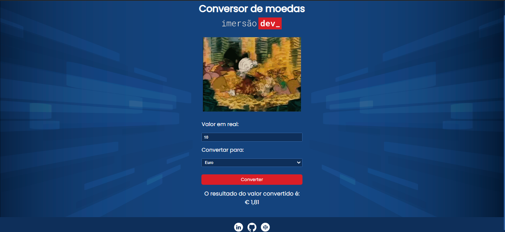

<h1 align="center"> ImersãoDev - Conversor de Moedas</h1>

A ImersãoDev da Alura consiste em 5 aulas gratuitas com grandes referências como Paulo Silveira, Rafaella Ballerini e Guilherme Lima, para criar um portfólio de programas incrível e começar a sua carreira em programação. 

  

---

## 💻 Projeto
Este projeto é  um conversor de moedas, onde você conseguirá converter real em euro, dólar ou criptomoeda.

---

## 🚀 Tecnologias

Esse projeto foi desenvolvido com as seguintes tecnologias:

- HTML e CSS
- JavaScript 